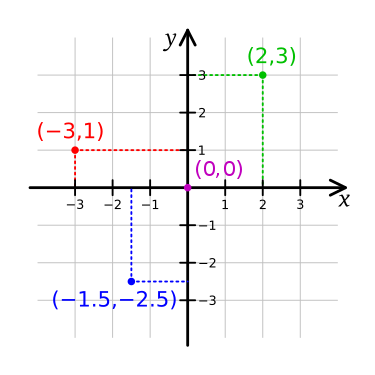

# D3.js

## Gráficos con D3

### El sistema de coordenadas

En matemáticas, concretamente en geometría, un sistema de coordenadas es un sistema de referencia que utiliza uno o más números (coordenadas) para determinar unívocamente la posición de un punto u objeto geométrico.

Concretamente, para la representación de puntos en un espacio euclídeo de dos o tres dimensiones, se usa el sistema de coordenadas cartesianas, que se compone de dos o tres ejes ortogonales igualmente escalados.

### Introducción a SVG

SVG (Scalable Vector Graphics) es un formato de gráficos vectoriales bidimensionales, tanto estáticos como animados, en formato de lenguaje de marcado extensible XML.

Esto significa que una imagen puede ser expresada con etiquetas, atributos y una jerarquía de elementos, de manera que un intérprete de SVG (e.g., un navegador web) pueda entenderlos y renderizar la imagen a partir de ellos.

Ejemplo:

    <svg viewBox="0 0 20 10" xmlns="http://www.w3.org/2000/svg" >
      <title>Estructura basica del SVG</title>
      
      <circle class="circle" cx="5" cy="5" r="5" />
    </svg>

<svg viewBox="0 0 20 10" xmlns="http://www.w3.org/2000/svg">
  <title>Estructura basica del SVG</title>
  
  <circle class="circle" cx="5" cy="5" r="5" />
</svg>

Las ventajas de usarlo son:

- Crear y editar con cualquier editor de texto.
- Buscar, indexar, codificar y comprimir.
- Imprimir con alta calidad en cualquier resolución.
- Pueden ser cambiadas de tamaño sin perder calidad de imagen o gráfico.
- Son escalables.
- SVG es un estándar abierto.
- Los archivos SVG estás compuesto por código XML puro.

### Introducción a D3

D3 (Data-Driven Documents), o también D3.js, es una librería para JavaScript de manipulación de documentos basados en datos.

Su filosofía se basa fuertemente en usar los estándares de los navegadores web para no depender de otras librerías o frameworks de terceros.

Para ello establece correspondencias entre datos y los objetos del árbol DOM, aplicando transformaciones al documento guiadas por esos datos.

A grandes rasgos, se basa principalmente en un objeto principal referenciado como d3, un método selector de elemento/s, seguido de los métodos de manipulación a aplicar a dicho/s elemento/s.

El caso general presenta la siguiente estructura:

    d3.method1(arguments).method2(arguments)...

Donde el `methodX` lo proporciona la librería y del que dependen los `arguments`, y es posible encadenar varios seguidos.

Ejemplos:

  - Selección

        d3.selectAll("p").style("color", "blue")

  - Propiedades dinámicas

        d3.selectAll("p").style("color", (d, i) => i % 2 ? "#fff" : "#eee")

  - Manipulación del DOM

        d3.select("body").append("p").text("Hello World!")

  - Transiciones

        d3.select("body").transition().style("background-color", "black")

[Descarga e instalación](https://d3js.org/)

### Creación de líneas de escala

Para la generación de gráficas, el primer paso es definir las escalas, que determinan las cantidades e intervalos de los datos a dibujar.

Habitualmente se usan las escalas lineales (`scaleLinear`) para datos cuantitativos, pero existen otros tipos como las de fechas (`scaleBand`) o barras (`scaleTime`).

Una escala se compone como mínimo de tres características principales:

- Eje: X (abscisas) o Y (ordenadas).
- Rango: Determina su tamaño en píxeles (origen y destino).
- Dominio: El conjunto de posibles valores a representar (mínimo y máximo).

Ejemplos:

    const widthScale = 960
    const heightScale = 540

    const xScale = d3.scaleLinear().range([0, widthScale])
    const yScale = d3.scaleLinear().range([heightScale, 0])

Además, las escalas ofrecen otros métodos para ajustes más concretos como añadir relleno, interpolación, etc.

### Márgenes

El siguiente paso es crear el objeto que generará el contenedor SVG en el documento HTML en el que pintará la gráfica.

Dicho SVG tiene unos parámetros configurables, entre ellos el tamaño de la gráfica (`viewBox`) definido por 4 puntos (origen y destino en X y en Y), de manera que es posible fácilmente añadir márgenes a la gráfica de esta forma:

- JavaScript:

      const margin = {top: 20, right: 20, bottom: 20, left: 20}
      const widthBox = 1280 - margin.left - margin.right
      const heightBox = 720 - margin.top - margin.bottom

      const svg = d3.select("#d3-box")
                    .append("svg")
                    .attr("viewBox", `0 0 ${widthBox} ${heightBox}`)

- HTML:

      

### Data binding

El tercer paso es cargar un conjunto de datos o *dataset*, generalmente de un fichero de tipo CSV, JSON u otro formato típico de datos estructurados. Esta tarea puede hacerse con los métodos específicos que ofrece la librería:

    // Promise notation
    d3.json("example-data.json")
      .then(data => {
        // ...
      })
    
    // async-await notation
    const data = await d3.csv("example-data.csv")

Además de para generar gráficas, es posible también asociar los datos cargados de esta forma a etiquetas del documento de esta forma:

- JavaScript:

    const dataset = ['Apple', 'Orange', 'Mango']

    d3.select("#fruits")
      .selectAll("p")
      .data(dataset)
      .join("p")
      .attr("class", "fruit")
      .text(d => d)

- HTML:

    

El último paso será la asociación de los datos cargados al contenedor SVG, indicando para cada uno de ellos los parámetros correspondientes (posición x e y, alto y ancho, color y/o estilos, etc.), que dependerán del tipo de gráfica que se desea representar.

### Gráficos de líneas

.

### Gráficos de columnas

.

### Gráficos de barras

.

### Gráficos circulares

.

## Gráficos de dispersión

.

## Redes con D3

### Gráficos de redes básicos

.

### Gráficos de redes avanzados

.

## Referencias generales

[Sistema de coordenadas](https://es.wikipedia.org/wiki/Sistema_de_coordenadas)  
[SVG](https://es.wikipedia.org/wiki/Gr%C3%A1ficos_vectoriales_escalables)  
[w3schoools](https://www.w3schools.com/js/js_graphics_d3js.asp)  
[Documentación oficial](https://d3js.org/)  
[Tutorial de introducción (freecodecamp)](https://www.freecodecamp.org/news/d3js-tutorial-data-visualization-for-beginners/)  
[Introducción a D3 (observablehq)](https://observablehq.com/@d3/learn-d3)  
[Ejemplo de márgenes](https://www.tomordonez.com/d3-visualization-margins/)  
